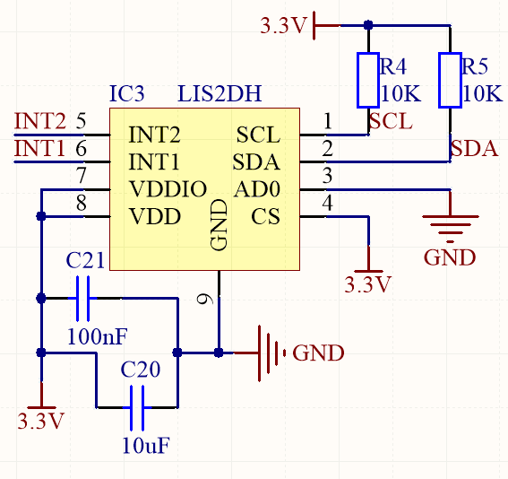

LIS2DH
======

Arduino device driver for communicating with LIS2DH accelerometer over I2C

Uses  I2C library

Warning: SPI mode is currently unsupported

========
Wiring Diagram
========

I2C lines: SDA and SCL